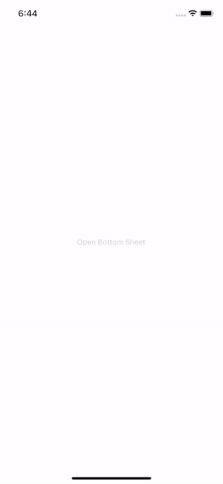
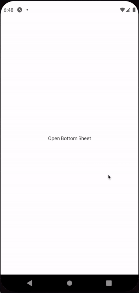
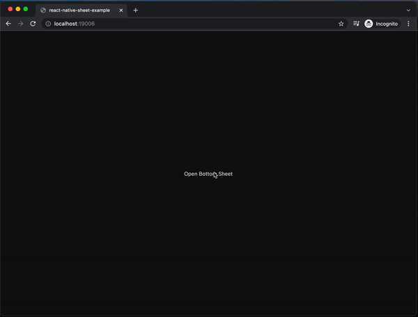

# React Native Sheet

[](https://www.npmjs.com/package/@harveyappleton/react-native-sheet) [](https://expo.io/)

A cross platform, lightweight, pure JS implementation (no dependencies) of bottom sheets in React Native, written in TypeScript.





## Features

- :computer: :iphone: **Cross platform**: iOS, Android and Web!
- :no_entry_sign: **No dependencies**: Just requires React Native and React peer dependencies.
- :last_quarter_moon: **Light and Dark mode** supported by default, and responds to changes automatically.
- :arrow_up_down: **Draggable**: You can drag to close once you cross the close threshold, and a drag marker will show to indicate this.
- :round_pushpin: **Closeable using background**: By tapping on the background behind the sheet, the sheet will be closed.
- :arrow_backward: **Closeable using Android back button**: will automatically close the bottom sheet OR call your own custom callback.
- :monocle_face: **Responds to height changes**: if the `height` prop changes, the bottom sheet will change height while open.
- :art: **Customisable and easy to style** with lots of prop options.
- :speech_balloon: **Callbacks galore**: Lots of easy to use callbacks, such as `onOpenStart` and `onOpenFinish`.
- :blue_book: **TypeScript** support - fully written in TypeScript.
- :white_check_mark: **Tested** using Jest.

## Like the library?

<a href="https://www.buymeacoffee.com/harveyappleton" target="_blank"></a> or a beer! :beer:

## Installation

```sh
npm install react-native-sheet
```

or, if you use Yarn

```sh
yarn add react-native-sheet
```

## Usage

**TypeScript example**

Add your ref using a hook and the BottomSheet component with its content. The props reference table is below, and the API of the ref is also below.

```tsx
import { BottomSheet } from 'react-native-sheet';

// ...

export default function App() {
  const bottomSheet = useRef<BottomSheetRef>(null);

  return (
    <View>
      <BottomSheet height={400} ref={bottomSheet}>
        <Text>Your bottom sheet content goes here</Text>
      </BottomSheet>
      <TouchableOpacity onPress={() => bottomSheet.current?.show()}>
        <Text>Open bottom sheet</Text>
      </TouchableOpacity>
    </View>
  );
}
```

**JavaScript example**

```jsx
import { BottomSheet } from 'react-native-sheet';

// ...

export default function App() {
  const bottomSheet = useRef(null);

  return (
    <View>
      <BottomSheet height={400} ref={bottomSheet}>
        <Text>Your bottom sheet content goes here</Text>
      </BottomSheet>
      <TouchableOpacity onPress={() => bottomSheet.current.show()}>
        <Text>Open bottom sheet</Text>
      </TouchableOpacity>
    </View>
  );
}
```

### Props

| Prop                      | Required | Description                                                                                                                                                                                                            | Possible Values            | Default                           |
| ------------------------- | -------- | ---------------------------------------------------------------------------------------------------------------------------------------------------------------------------------------------------------------------- | -------------------------- | --------------------------------- |
| `children`                | Yes      | The content to show inside the Bottom Sheet.                                                                                                                                                                           | React Node                 | -                                 |
| `height`                  | Yes      | The height of the bottom sheet once opened.                                                                                                                                                                            | number                     | -                                 |
| `onRequestClose`          | No       | `Android` only, when the user presses the device's back button, this callback will be called. Important: if you do NOT provide this prop, when the user presses the device's back button, the bottom sheet will close. | undefined OR void function | undefined                         |
| `colorScheme`             | No       | Force the bottom sheet to be a specific colour scheme. 'auto' will use host OS colour scheme (eg light or dark) and automatically change when host OS scheme changes.                                                  | 'auto', 'light', 'dark'    | 'auto'                            |
| `backdropClosesSheet`     | No       | Whether tapping/clicking on the backdrop behind the bottom sheet will close it.                                                                                                                                        | true/false                 | true                              |
| `backdropBackgroundColor` | No       | RGBA or Hex string value for the backdrop color.                                                                                                                                                                       | RGBA/Hex string            | '#25252599'                       |
| `sheetBackgroundColor`    | No       | RGBA or Hex string value for the background color of the bottom sheet.                                                                                                                                                 | RGBA/Hex string            | Dark: '#222222', Light: '#F3F3F3' |
| `sheetStyle`              | No       | Inline JS style override for bottom sheet                                                                                                                                                                              | Style object               | undefined                         |
| `draggable`               | No       | Whether the bottom sheet is draggable.                                                                                                                                                                                 | true/false                 | true                              |
| `showDragIcon`            | No       | Whether to show the drag icon handle. Only displayed if `draggable` is set to true as well.                                                                                                                            | true/false                 | true                              |
| `dragIconColor`           | No       | RGBA or Hex string value for the color of the drag icon handle.                                                                                                                                                        | RGBA/Hex string            | Dark: '#444444', Light: '#A3A3A3' |
| `dragIconStyle`           | No       | Inline JS style override for drag icon handle.                                                                                                                                                                         | Style object               | undefined                         |
| `contentContainerStyle`   | No       | Inline JS style override for content container style.                                                                                                                                                                  | Style object               | undefined                         |
| `borderRadius`            | No       | How rounded the corners of the sheet should be.                                                                                                                                                                        | number                     | 10                                |
| `openTime`                | No       | How long the opening animation should take.                                                                                                                                                                            | number                     | 300                               |
| `closeTime`               | No       | How long the closing animation should take.                                                                                                                                                                            | number                     | 300                               |
| `onOpenStart`             | No       | Called when the bottom sheet _begins_ to open.                                                                                                                                                                         | Void function              | undefined                         |
| `onOpenFinish`            | No       | Called when the bottom sheet _finishes_ opening.                                                                                                                                                                       | Void function              | undefined                         |
| `onCloseStart`            | No       | Called when the bottom sheet _begins_ to close.                                                                                                                                                                        | Void function              | undefined                         |
| `onCloseFinish`           | No       | Called when the bottom sheet _finishes_ closing.                                                                                                                                                                       | Void function              | undefined                         |

### Ref functions

Used by calling the functions on the ref, eg `bottomSheet.current?.show()`.

| Function  | Description              |
| --------- | ------------------------ |
| `.show()` | Opens the bottom sheet.  |
| `.hide()` | Closes the bottom sheet. |

## Example app

See the example folder for an example app.
Simply:

1. Open `example` folder in a terminal (eg `cd example`)
2. Run `yarn install` to install dependencies
3. Run `yarn start` to open Expo and from there, you can open the example app in iOS, Android and Web.

## Tests

Run `yarn test` to run all tests.

## Author

[Harvey Appleton](https://github.com/harveyappleton/)

## Contributing

See the [contributing guide](CONTRIBUTING.md) to learn how to contribute to the repository and the development workflow.

## License

MIT

PRs are most welcome, with the requirement that they meet eslint, TypeScript and testing standards.
